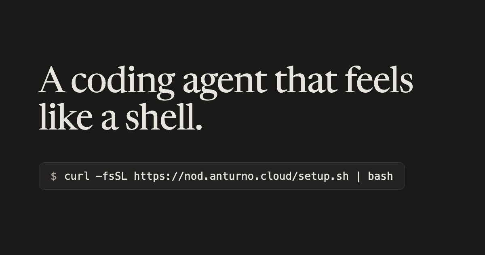

# nod

[](https://nod.anturno.cloud)

[](https://github.com/anturno/nod/actions/workflows/ci.yml) [](LICENSE)

A coding agent for your terminal that runs on your ChatGPT or Grok subscription. No API key, nothing billed per token.

## Install

```bash
curl -fsSL https://nod.anturno.cloud/setup.sh | bash
```

Or from source with [Bun](https://bun.sh) 1.4+: `bun install -g github:anturno/nod`

## Use

```bash
nod login codex   # or: nod login grok
nod               # interactive shell
nod ask "fix the failing test in src/math.ts"
```

Type `/help` in the shell for commands. Full docs at [nod.anturno.cloud](https://nod.anturno.cloud).

## A note on subscriptions

Sign-in uses the OAuth clients of OpenAI's Codex CLI and xAI's Grok CLI against backends that aren't public APIs and can change without notice. You're responsible for following each provider's terms.

## Contributing

See [CONTRIBUTING.md](CONTRIBUTING.md), the [Code of Conduct](CODE_OF_CONDUCT.md), and [SECURITY.md](SECURITY.md).

## License

[Apache-2.0](LICENSE)
